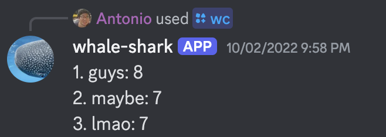

# Portfolio
This repo contains two of my personal projects.

## Polygon.io Stock Data Pipeline 
This event-driven pipeline can fetch stock data from polygon.io's API. These data points can be used to predict future stock prices. In the image below, we create a simple regression on American Airlines stock. The light blue line represents the line of best fit based on the green training dots. The navy blue line shows how the regression predicts future prices, while the black dots indicate the actual prices. The code to generate this is in the jupyter notebook [here](./polygonio%20stock%20data%20pipeline/notebooks). 

  

This pipeline is based on AWS, with each Lambda Function representing a different task in the pipeline. All the AWS infrastructure is also Terraformed. 

## Whale Shark
Whale Shark is a discord bot that can show users their most commonly used words in a server. 

  

The bot itself was hosted on an EC2 instance, where it tracks user messages and logs them. Whale Shark has an opt-in/opt-out feature which allows users to stop the bot from storing their data.

  

  

Whale Shark's data is saved in S3 and the word count calculations are done through Lambda. All the AWS infrastructure is Terraformed, with an Atlantis application that allows Terraform applies to occur in the github repository. 
