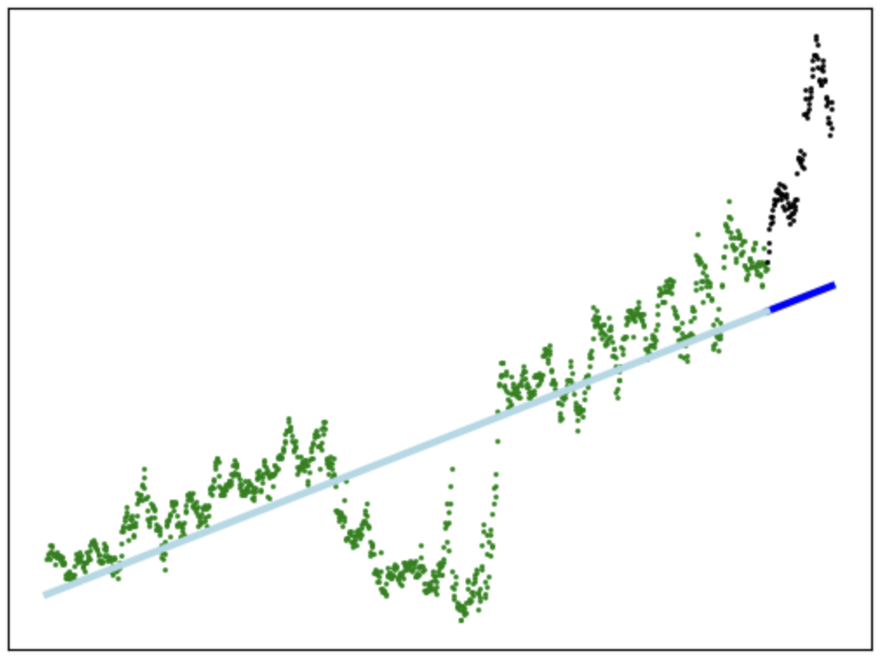

# Portfolio
This repo contains two of my personal projects.

## Polygon.io Stock Data Pipeline 
This event-driven pipeline can fetch stock data from polygon.io's API. These data points can be used to predict future stock prices, a simple example is shown in the jupyter notebook [here](./polygonio%20stock%20data%20pipeline/notebooks).

This pipeline is based on AWS, with each Lambda Function representing a different task in the pipeline. All the AWS infrastructure is also Terraformed. 

## Whale Shark
Whale Shark is a discord bot that can 
